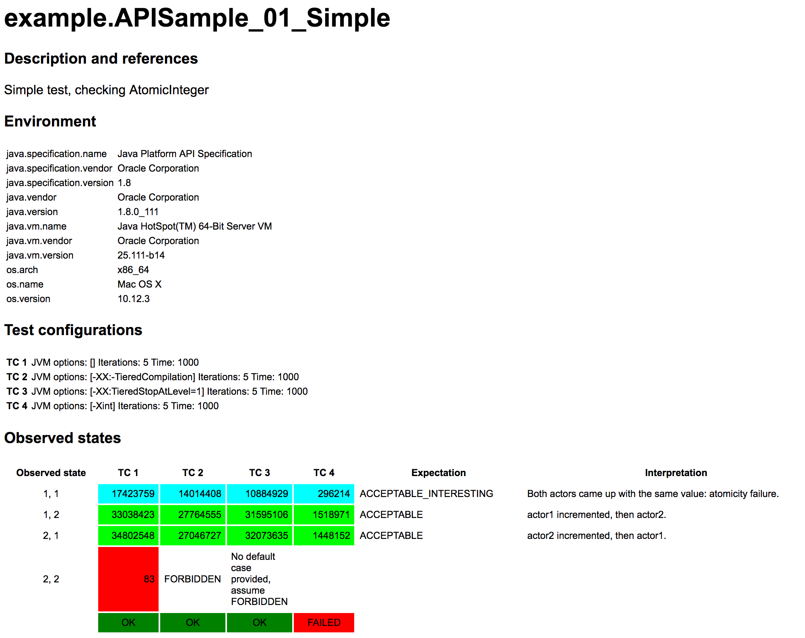

# sbt-jcstress

[  ](https://bintray.com/ktosopl/sbt-plugins/sbt-jcstress/_latestVersion)

The Java Concurrency Stress tests (jcstress) is an experimental harness and a suite of tests to aid the research in the 
correctness of concurrency support in the JVM, class libraries, and hardware. 

jcstress is part of OpenJDK: https://wiki.openjdk.java.net/display/CodeTools/jcstress

**Sidenote:** jcstress is a *very* specialized tool, and unlike jmh (and sbt-jmh), 
it is rather unlikely you actually need it - unless you're implementing low level concurrency primitives.

The plugin is available for sbt 1.0.0.

-----

The purpose of this plugin is to make it trivial to use jcstress with sbt.

Get the latest via:

```
// project/plugins.sbt
addSbtPlugin("pl.project13.scala" % "sbt-jcstress" % pluginVersionHere)
```

and enable it:

```
// build.sbt
enablePlugins(JCStressPlugin)
```

To run all tests you can simply invoke:
 
```
 > jcstress:run
```

Results are thena available in `results/index.html` and respective pages for each test.
[Here's an example](http://htmlpreview.github.io/?https://github.com/ktoso/sbt-jcstress/blob/master/example-output/index.html) of how a failed spec would look like (modified example to make it fail):




Contribute!
-----------
Please note that this plugin is mostly developed on a "on demand" basis by and for myself, contributions are very (!) welcome 
since I most likely will not focus much on it unless I need more features (and for now estimates and internal are all I needed).
 
 License
 -------
 
 Apache v2
